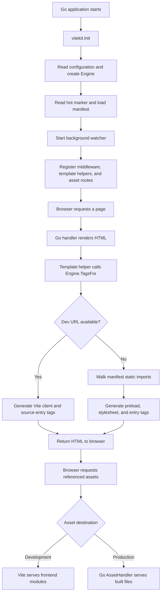
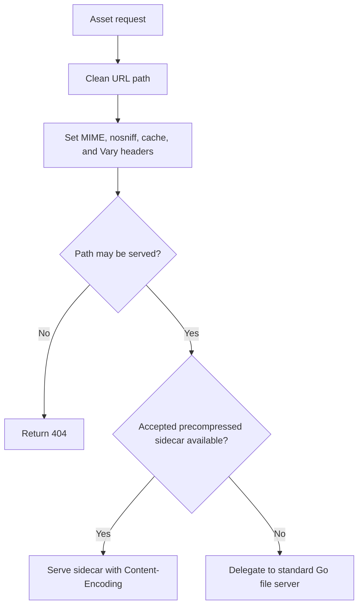

# ViteKit execution flow

ViteKit connects HTML rendered by a Go backend to frontend assets managed by Vite. In development, it generates tags pointing to the Vite development server. In production, it reads Vite's build manifest, generates tags for built assets, and provides a handler that serves those files.

## Overall flow



## 1. Configure and initialize

Relevant code: [config.go](config.go), [engine.go](engine.go), and [the Gin example](example/gin/main.go).

The Gin example initializes ViteKit like this:

```go
fsys := os.DirFS("frontend")
if err := vitekit.Init(fsys,
    vitekit.WithDevMode(),
    vitekit.WithEntry("src/main.jsx"),
    vitekit.WithRootDir("frontend"),
); err != nil {
    log.Fatalf("failed to initialize vitekit: %v", err)
}
engine := vitekit.Service()
```

| Expression | Meaning |
| --- | --- |
| `os.DirFS("frontend")` | Read files relative to the frontend directory. |
| `WithDevMode()` | Allow initialization before a production manifest exists. |
| `WithEntry("src/main.jsx")` | Use this entry when an empty entry is supplied. |
| `WithRootDir("frontend")` | Tell the OS file watcher where the frontend lives on disk. |
| `Service()` | Return the shared initialized engine; panic if initialization has not occurred. |

`WithDevMode()` permits a missing manifest; the presence of a development URL is what selects development rendering.

Inside `Init()`, execution follows this order:

```text
defaultConfig()
    -> apply explicit options
    -> newEngine()
    -> NewWatcher()
    -> refreshDevURL()
    -> reloadManifest()
    -> StartWatching()
    -> publish globalEngine
```

Configuration starts with defaults and environment variables. Explicit options are applied afterward. Initialization fails when the manifest cannot be loaded, there is no development URL, and missing manifests have not been allowed.

`WithPrefix(...).New(...)` provides a similar initialization path for an independent engine. It returns the engine, a function to cancel its watcher, and an error.

## 2. Store runtime state in Engine

Relevant code: [engine.go](engine.go).

```go
fsys      fs.FS
manifest  atomic.Pointer[map[string]ManifestEntry]
devURL    atomic.Pointer[string]
generated atomic.Pointer[map[string]struct{}]
```

| Field | Responsibility |
| --- | --- |
| `fsys` | Read files from disk or an embedded filesystem. |
| `manifest` | Map source entries and chunks to built filenames and dependencies. |
| `devURL` | Hold the current development-server URL. |
| `generated` | Record generated filenames for asset caching decisions. |

`reloadManifest()` tries the configured path and, for the default path, conventional alternatives. It can also perform a bounded search for a manifest. `storeManifestFrom()` parses the JSON and publishes the generated-file set and manifest.

Atomic pointers let request handlers read published state without acquiring the reload mutex. A production dependency walk uses one loaded manifest snapshot throughout its traversal.

## 3. Connect the engine to the web framework

The adapters expose the engine to framework handlers:

| Adapter | Execution |
| --- | --- |
| [Gin](adapter/gin/gin.go) | Store the engine using `context.Set("vite", engine)`, then call `context.Next()`. |
| [Fiber](adapter/fiber/fiber.go) | Store the engine using `context.Locals("vite", engine)`, then call `context.Next()`. Also expose `FuncMap()` for compatible template engines. |
| [Echo](adapter/echo/echo.go) | Wrap the original context in a custom context. Its `Vite()` method calls `engine.TagsWithOptions()`. |

The Gin middleware is:

```go
func Middleware(engine *vitekit.Engine) gin.HandlerFunc {
    return func(context *gin.Context) {
        context.Set("vite", engine)
        context.Next()
    }
}
```

The outer function runs during middleware registration and captures the engine pointer. The returned function runs on each request, adds that pointer to the request context, and continues processing.

The application separately registers template helpers and mounts asset routes. Middleware alone does not perform either operation.

## 4. Render HTML tags

Relevant code: [walker.go](walker.go).

Registering `engine.FuncMap(vitekit.RenderOptions{})` with a Go template makes this helper available:

```gotemplate
{{ vite "src/main.jsx" }}
```

Its call chain is:

```text
template helper "vite"
    -> Engine.TagsFor(entries, options)
    -> resolveEntries()
    -> DevURL()
        -> devTags(), if a development URL exists
        -> productionTags(), otherwise
```

The direct API `engine.Tags(entry)` reaches the same path through `TagsWithOptions()`. Template helpers capture the engine directly; they do not need to retrieve it from the framework request context.

### Development rendering

For a development URL of `http://localhost:5173`, generated tags look like:

```html
<script type="module" src="http://localhost:5173/@vite/client" crossorigin></script>
<script type="module" src="http://localhost:5173/src/main.jsx" crossorigin></script>
```

The browser receives HTML from Go and fetches the modules directly from Vite. Vite's client handles hot updates. Stylesheet entries receive stylesheet links.

For React, the separate `viteReactPreamble` template helper supplies the refresh bootstrap needed when Go owns the HTML response.

### Production rendering

`productionTags()` calls `walk()`, validates requested entries, and follows their static imports using `descend()`.

For example:

```text
src/main.jsx
    file: assets/main-AAAAAAAA.js
    css:  assets/main-BBBBBBBB.css
    imports:
        _vendor.js
            file: assets/vendor-CCCCCCCC.js
```

Produces tags resembling:

```html
<link rel="modulepreload" href="/assets/vendor-CCCCCCCC.js" crossorigin>
<link rel="stylesheet" href="/assets/main-BBBBBBBB.css">
<script type="module" src="/assets/main-AAAAAAAA.js"></script>
```

Output order is module preloads, collected stylesheets, and then entry tags.

The graph tracks visited chunks to prevent repeated traversal and cycles. It also tracks CSS and preload dependencies to avoid duplicate dependency tags. `TagsFor()` can process multiple entries together so shared dependencies are collected once.

The traversal follows `Imports`, not `DynamicImports`, preserving lazy loading. URLs are constructed from the configured asset prefix and manifest filenames; HTML attribute values are escaped. `RenderOptions.Nonce` adds a nonce attribute to generated tags.

## 5. Serve built files: server.go

Relevant code: [server.go](server.go).

This file sends built JavaScript, CSS, images, and fonts to the browser. It wraps Go's standard file server with access checks, caching rules, MIME corrections, and support for precompressed files.

With the example's filesystem and default output directory:

```text
GET /assets/main-AAAAAAAA.js
    -> Gin asset route
    -> assetHandler.ServeHTTP()
    -> frontend/dist/assets/main-AAAAAAAA.js
    -> response bytes and headers
```

### Prepare the handler once

`AssetHandler()` starts with:

```go
assets, err := fs.Sub(e.fsys, e.outputDir)
```

This creates a filesystem view rooted at the build output directory. It then creates the standard Go file server:

```go
files: http.FileServer(http.FS(assets))
```

The returned wrapper holds:

```go
type assetHandler struct {
    engine *Engine      // Build metadata for caching decisions
    assets fs.FS        // Built files
    files  http.Handler // Standard Go file server
}
```

Creating the handler does not start an HTTP server. The application mounts it in its router. The Gin example uses `gin.WrapH(assets)` at `/assets/*filepath`.

With the default asset prefix, the request retains `/assets/`: that directory exists inside `dist`. A custom asset prefix must agree with the router's mount and any prefix stripping.

### Handle each asset request



`ServeHTTP()` coordinates the following helpers:

| Helper | Decision |
| --- | --- |
| `serveable()` | Is the path allowed? |
| `cacheControl()` | How may the response be cached? |
| `acceptedEncodings()` | Which compressed encodings does the browser accept? |
| `servePrecompressed()` | Can an existing compressed sidecar satisfy the request? |

### Access checks

`serveable()` rejects paths containing a `.vite` directory and rejects directories themselves, preventing directory listings. Other dot-paths remain allowed, supporting files under `.well-known`.

Missing files normally reach the standard file server, which produces the 404 response.

### Response headers and caching

| Header | Purpose |
| --- | --- |
| `Content-Type` | Identify the file type; correct selected frontend extensions. |
| `X-Content-Type-Options: nosniff` | Tell the browser to respect the declared content type. |
| `Cache-Control` | Specify whether the asset can be reused or must be revalidated. |
| `Vary: Accept-Encoding` | Tell caches that the representation depends on accepted compression. |

Long-lived caching requires both conditions:

```go
h.engine.isGeneratedFile(name) && hashedFileName.MatchString(name)
```

A manifest-listed file matching the hash filename pattern receives:

```text
public, max-age=31536000, immutable
```

Other files receive:

```text
public, max-age=0, must-revalidate
```

The distinction matters because a content change normally gives a hashed build asset a new URL. A copied public file such as `logo.png` can change while keeping the same URL.

### Precompressed files

A build can contain:

```text
main-AAAAAAAA.js       Original file
main-AAAAAAAA.js.br    Brotli sidecar
main-AAAAAAAA.js.gz    Gzip sidecar
```

For GET and HEAD requests, the handler tries an accepted Brotli sidecar first, then gzip. Encoding parsing honors explicit `q=0` rejections. A usable sidecar must support seeking so `http.ServeContent()` can handle range requests.

If no usable sidecar is available, the standard file server handles the original path. This code serves existing compressed files; compression must happen elsewhere.

## 6. Start and stop development processes

Relevant code: [process.go](process.go) and [cli/dev.go](cli/dev.go).

`Init()` initializes the engine and watcher. Starting Vite is the separate responsibility of `DevOrchestrator`.

```text
DevOrchestrator.Run()
    -> remove stale hot marker
    -> check development command
    -> choose/configure Vite port
    -> start Vite and relay its output
    -> start backend callback concurrently
    -> detect Vite URL and write .vite/hot
    -> wait for cancellation or an exit
    -> stop Vite process tree and remove hot marker
```

URL detection can use process output, a hot marker, or the configured port becoming reachable. Backend startup and URL detection run concurrently, so the backend may initially start before the hot marker is available.

`StartDevInDir()` launches the command through the platform shell, configures process handling, and starts goroutines to wait for exit and react to context cancellation. `Stop()` coordinates termination once, with a grace period and a force-kill fallback.

`cli.Dev()` connects the orchestrator to either an application backend command or the built-in preview server. A custom backend callback is responsible for honoring its cancellation context.

For production builds, [cli.Build()](cli/build.go) runs the configured build command and waits for completion. At runtime, production rendering uses the resulting manifest and files.

## 7. Keep rendering state up to date

Relevant code: [watcher.go](watcher.go).

```text
Hot marker appears or changes
    -> read URL from .vite/hot
    -> update Engine.devURL
    -> subsequent tag rendering uses Vite

Hot marker disappears
    -> clear Engine.devURL
    -> subsequent tag rendering uses the manifest

Configured manifest receives create/write event
    -> reloadManifest()
    -> publish updated build metadata
```

The watcher combines filesystem notifications with periodic hot-marker polling. Polling is every two seconds when an OS watch was established, or every 250 milliseconds when no watch could be established. The polling branch refreshes the hot marker, not the manifest.

Removing the hot marker selects the production rendering path, which still requires a loaded manifest. Allowing startup without a manifest does not make production rendering possible by itself.

## 8. Understand the benchmarks

Relevant code: [bench_test.go](bench_test.go).

The benchmarks measure tag rendering, rendering with a nonce, preload resolution, CSP generation, asset serving, and parallel tag rendering. Setup loads a sample manifest before resetting the timer, keeping initialization outside the timed request path.

These benchmarks run during benchmarking, not during application startup or normal requests.

## Code reading order

1. [example/gin/main.go](example/gin/main.go): see how an application wires everything together.
2. [config.go](config.go) and [engine.go](engine.go): understand configuration and initialization.
3. [adapter/gin/gin.go](adapter/gin/gin.go): understand request context integration.
4. [walker.go](walker.go): follow HTML tag generation.
5. [server.go](server.go): follow requests for built asset bytes.
6. [watcher.go](watcher.go): understand runtime mode changes.
7. [process.go](process.go): understand development process orchestration.
